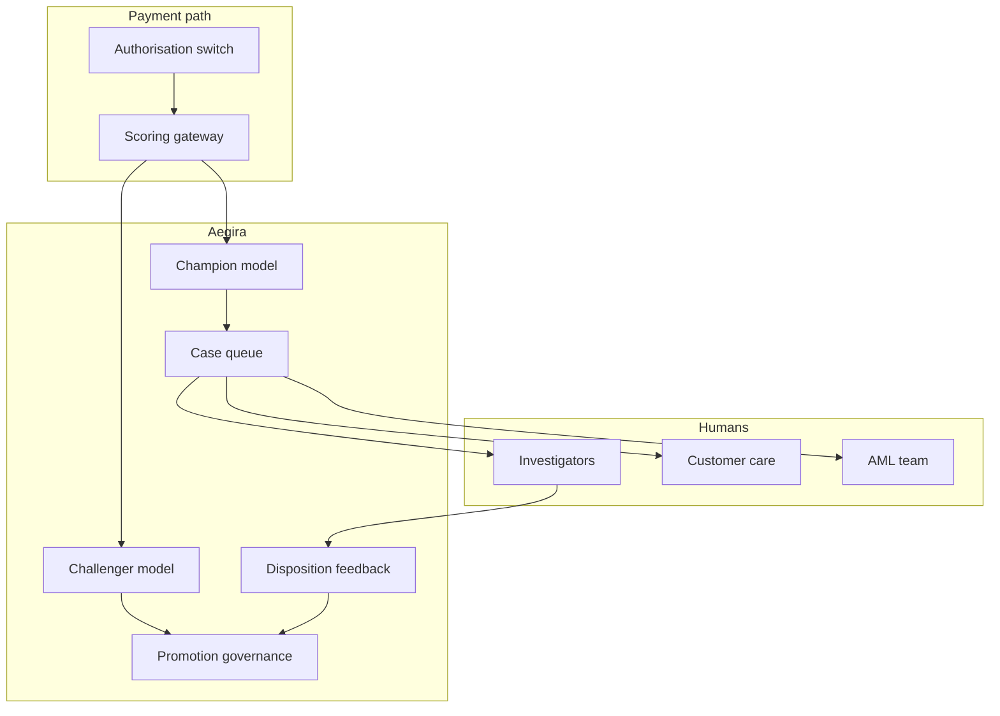

# Aegira

**Source:** `ai-in-financial/ai-in-finance/`
**Domain:** `ai-fin`
**One-liner:** A fraud-operations workbench that scores transactions with challenger models, queues investigator-ready cases, and measures false-positive burn so banks stop treating fraud ML as a silent score in the payments path.
**Wedge:** Mid-to-large retail banks and processors whose fraud teams drown in alerts from rules-plus-ML stacks and need case orchestration, challenger promotion, and analyst feedback loops.
**Positioning:** Fraud ops, not generic “AI in finance.” The Evolve Machine Learners deck lists fraud detection among core FS ML use cases (logistic regression through LSTMs) beside credit, chatbots, and trading; Aegira productises the operational system around fraud models—the Queue, the Challenger, the Case—so detection improvements become investigator throughput.

## Market research synthesis

### Thesis from source

The training deck surveys ML in capital markets, consumer banking, insurance, and equities, driven by rising risk/regulatory requirements, digital channels, and deep learning. It positions financial institutions as archetypal big-data organisations (volume/variety/velocity) and enumerates use cases: sentiment, trading signals, fraud detection, credit scoring, insurance, chatbots, portfolio management. Fraud is specified with classical ML (logistic regression, trees, forests, clustering) and deep sequence models (RNN/LSTM). Adjacent proof points include Square’s use of ML for risk/fraud and Capital One’s ENO, BofA Erica, and JPMorgan COIN as automation analogues—showing FS buyers already accept AI in production when the workflow is clear.

The product insight: listing algorithms is not a company. Fraud teams lose money twice—once to fraud loss, again to false-positive customer friction and investigator overtime. Aegira’s wedge is the ops layer that runs an operational model and a challenger, promotes on evidenced lift, and turns scores into cases with features, customer context, and disposition feedback that retrains the loop—mirroring industry patterns the broader FS AI literature (e.g. Feedzai-style challengers) already normalised.

### Buyer & economic model

- **Primary buyer:** Head of Fraud / Chief Fraud Officer or Head of Payments Risk.
- **Users:** fraud investigators, queue managers, model owners, customer-care escalation partners, financial crime compliance.
- **Budget owner / value metric:** fraud loss budget plus ops cost. Value metric is fraud dollars prevented net of false-positive cost and investigator hours per confirmed case.
- **Competing status quo:** static rules in the authorisation switch; ML scores without case UI; spreadsheet queues; model updates via quarterly IT releases without challenger discipline.

### Domain constraints

- **Regulatory / trust / safety:** unfair denial of payments; adverse action explanations where required; AML boundary clarity (Aegira is fraud ops first; SAR-worthy patterns escalate out); model risk management.
- **Data sensitivity:** card/transaction data, device prints, and identity graph are highly sensitive PCI/PII.
- **Change-management realities:** authorisation path latency budgets are tight; heavy investigation UX must sit off the hot path with asynchronous case creation.

## Business requirements

- BR-1: Every scored event must be attributable to a named model version (champion or challenger) with feature snapshot retained for the case.
- BR-2: Challenger models must run in shadow or limited traffic with promotion criteria agreed before go-live.
- BR-3: Alerts must become cases with prioritisation, SLA clocks, and disposition codes—not only risk scores.
- BR-4: Investigators must capture feedback that is usable for supervised retrain (fraud confirmed, friendly fraud, false positive, unable to determine).
- BR-5: False-positive rate and customer-friction events (declines, lockouts) must be reported beside loss prevented.
- BR-6: Hot-path scoring latency budgets must be configurable and monitored; breaches page on-call, not only fraud analysts.
- BR-7: Case packages must exclude unnecessary PCI payloads while remaining investigative-useful.
- BR-8: Linked-entity graphs (device, payee, merchant) must support investigation without unconstrained PII browse.
- BR-9: Escalation to AML/financial-crime must be a controlled handoff with reason codes—not a silent duplicate queue.
- BR-10: Model promotion and rollback must be dual-controlled and auditable.
- BR-11: Customer-care must see safe status summaries for locked cards/payments without raw fraud-model internals.
- BR-12: Aegira must not originate credit decisions or investment advice—fraud ops boundary only.

## User stories

Canonical user stories live in sibling [USER_STORIES.md](USER_STORIES.md).

## System design

### Overview

Aegira scores payment and account events via champion/challenger models, opens cases when thresholds or rules fire, supports investigator workflows and entity linking, records dispositions, and feeds metrics for promotion. Care and AML receive bounded views/handoffs.

### Actors & boundaries

- **Actors:** scoring gateway, investigator, queue manager, model owner, care agent, AML recipient.
- **Trust boundary:** hot-path scorer is isolated; case store is access-controlled; model training environments do not get unrestricted production PCI dumps.
- **Human-in-the-loop points:** case disposition; model promotion; AML escalation accept/reject.

### Core capabilities

1. **Event scoring API** — champion/challenger.
2. **Case management** — queue, SLA, disposition.
3. **Entity linking** — device/payee/merchant graphs.
4. **Challenger governance** — shadow, promote, rollback.
5. **Feedback capture** — labelled outcomes.
6. **Ops metrics** — loss, FP, latency, SLA.
7. **Care-safe status views**.
8. **AML handoff**.

### Conceptual data

- **Primary entities:** ScoreEvent, ModelVersion, Case, Disposition, EntityLink, ChallengerExperiment, PromotionDecision, CareStatus, AmlHandoff.
- **Critical events:** scored, case opened, dispositioned, promoted, rolled back, escalated.
- **Retention / audit needs:** cases and score feature snapshots retained for fraud dispute and model-risk windows; PCI minimisation enforced.

### Integrations (conceptual)

- **Systems of record:** authorisation/switch, core banking, card management, case/AML systems.
- **Upstream signals:** device intelligence, merchant risk, consortium fraud tips.
- **Downstream actions:** decline/step-up, card lock, customer notify, AML case create.

### High-level architecture

### Success metrics

- **Leading:** challenger shadow coverage; median case handle time; % dispositions with quality labels; scoring p99 latency.
- **Lagging:** fraud loss rate; false-positive rate; investigator FTE per $bn notional; customer complaint rate on blocks.

## OpenAPI skeleton

Canonical HTTP surface lives in sibling [openapi.yaml](openapi.yaml). Summary:

- **Base path:** `/v1/...`
- **Auth:** `X-API-Key` for scoring gateways; Bearer JWT for investigators and admins.
- **Resource groups:** Scores, Cases, Dispositions, Entities, Models, Experiments, Handoffs.
