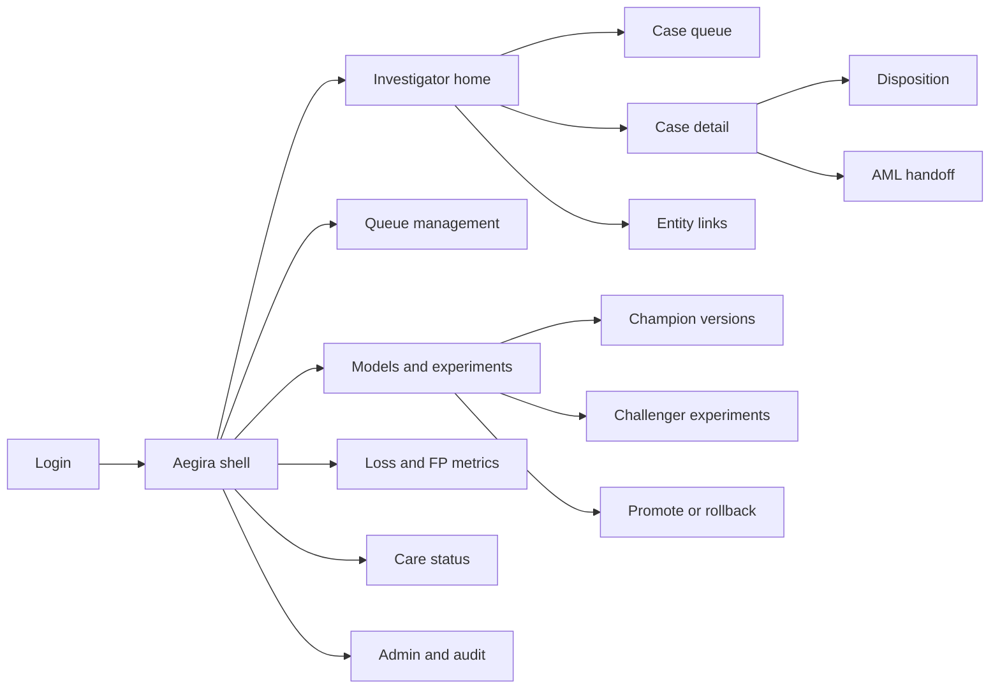
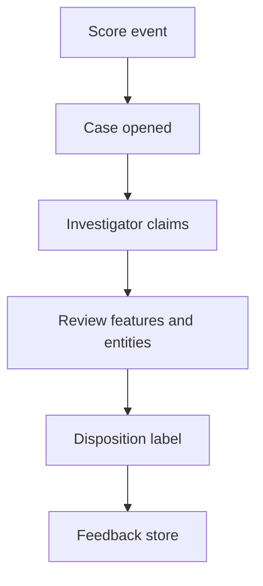
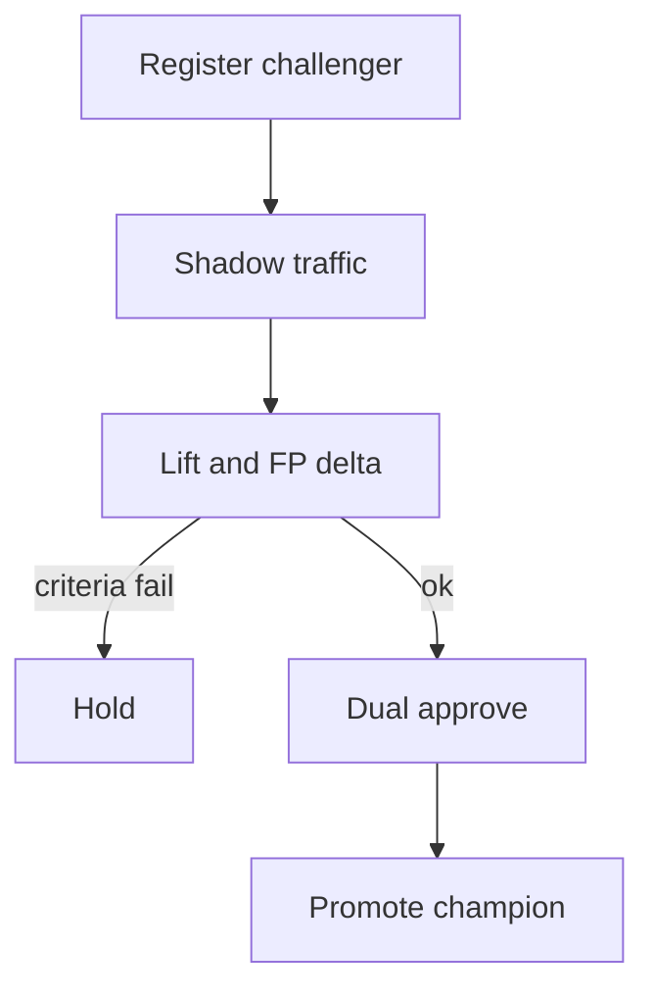

# Aegira — Web app

**Product:** [PRODUCT.md](./PRODUCT.md)
**Primary surface:** Fraud-operations workbench (investigator queue + model governance under one Aegira shell)
**Secondary surfaces:** Care-safe status portal (bounded read-only); AML handoff receipt view (read-only confirmation)
**Design thesis:** Aegira is a case floor attached to a payment-risk scorers' bay—not a generic “AI insights” dashboard. The metaphor is a night-shift investigation desk: cool charcoal ground, sodium-amber SLA clocks, and signal-red for hot-path latency or confirmed fraud loss. Champion vs challenger reads as two rails on the same track; settled dispositions lock like stamped case files. The Aegira wordmark sits as a quiet mint seal on every money-and-risk surface so ops never confuse this console with AML or credit decisioning.

## UX research synthesis

### Category peers (best-in-class)

- **Feedzai RiskOps:** Challenger/shadow promotion, case packages with feature explain, FP vs loss side-by-side. Steal: dual-rail champion/challenger metrics on the same period; reject Feedzai’s full platform sprawl—Aegira stays fraud-ops only (BR-12).
- **Featurespace ARIC Risk Hub:** Dense investigator queues with reason codes and entity linking without free-browse PII. Steal: prioritised queue with SLA clocks and graph hops limited by policy; reject black-box “risk score only” case headers.
- **Unit21 / Sift Console:** Disposition taxonomies that feed model feedback loops; alert→case→label as one path. Steal: one-click dispositions mapped to retrain labels; reject marketing-style “trust score” hero tiles.
- **Forter Decision Manager (merchant fraud):** Latency and decline friction as first-class ops metrics. Steal: false-positive / customer-friction strip beside loss prevented (BR-5); reject merchant-checkout aesthetics for bank investigator UX.

### Patterns to adopt / reject

- **Adopt:** Case queue as default home for investigators; named model version on every score; feature highlights not raw PCI; dual-control promote/rollback; care-safe status without model internals; controlled AML handoff with reason codes.
- **Reject:** Purple “AI copilot” as primary investigation UX; editable historical loss totals; rainbow KPI card grids; dashboard-of-everything as investigator home; unconstrained customer PII search.

### Trust, density, and workflow constraints from PRODUCT.md

Investigators need dense case packages without PCI dumps (BR-7). Scoring stays on the hot path with monitored latency budgets (BR-6); the web console is off-path case work. Model promotion is dual-controlled and auditable (BR-10). Care sees status summaries only (BR-11). AML is an explicit handoff, not a duplicate queue (BR-9). Boundary: no credit or investment advice surfaces (BR-12).

## Information architecture

### Nav model

### Roles → default home

| Role | Default home | Why |
|------|--------------|-----|
| Fraud investigator | Case queue | Daily throughput (BR-3, BR-4) |
| Queue manager | Queue management — SLA heatmaps | Staff peaks |
| Model owner | Models and experiments | Shadow before promote (BR-2, BR-10) |
| Head of fraud | Loss and FP metrics | Net value, not vanity blocks (BR-5) |
| Customer care agent | Care status | Safe unblock path (BR-11) |
| Platform admin | Admin and audit | PCI controls + promotion audit |

### Cross-links to OpenAPI resources

| Nav area | OpenAPI tags / resources |
|----------|---------------------------|
| Scoring / hot-path health | Scores |
| Case queue and detail | Cases |
| Dispositions | Dispositions |
| Entity links | Entities |
| Champion / challenger versions | Models |
| Shadow experiments | Experiments |
| AML escalation | Handoffs / aml-handoffs |

## Screen inventory

### Investigator home / case queue

- **Purpose:** Answer “what should I work next?” with prioritised cases, SLA clocks, and reason codes—not a risk-score wall.
- **Entry:** Post-login for investigator roles; deep link from SLA breach alerts.
- **Layout regions:** Brand + queue filter chrome; priority table (value, segment, SLA remaining, model version); bulk claim strip; alerts rail (latency pages routed to on-call, not buried in queue).
- **Primary actions:** Claim case; filter by segment/policy; jump to breached SLAs.
- **Empty / loading / error:** Empty = “queue clear—check shadow challenger noise”; loading = skeleton rows; error = retry with request id.
- **BR / story ties:** BR-3; investigator stories.

### Case detail

- **Purpose:** Investigate with feature highlights, customer context, and entity links without reverse-engineering a silent score.
- **Entry:** Queue row; care escalation deep link (bounded).
- **Layout regions:** Case header (status, SLA, champion/challenger attribution); feature highlight panel; transaction timeline (PCI-minimised); entity link pane; disposition dock; AML handoff action.
- **Primary actions:** Disposition; link related cases; escalate to AML; request care-safe status refresh.
- **Empty / loading / error:** Missing feature snapshot = blocking banner with model-version gap; access denied = audit-logged denial.
- **BR / story ties:** BR-1, BR-7, BR-8, BR-9.

### Disposition capture

- **Purpose:** One-click labelled outcomes that feed supervised retrain.
- **Entry:** Case detail dock; keyboard shortcuts from queue.
- **Layout regions:** Disposition code set (fraud confirmed, friendly fraud, false positive, unable to determine); optional note; feedback quality indicator.
- **Primary actions:** Submit disposition; undo within short window before lock.
- **Empty / loading / error:** Validation if code missing; locked after audit close.
- **BR / story ties:** BR-4.

### Entity links

- **Purpose:** Device / payee / merchant graph hops within policy—organised pattern catch without unconstrained PII browse.
- **Entry:** Case detail; queue “related” affordance.
- **Layout regions:** Constrained graph canvas; linked case list; policy remaining-hop indicator.
- **Primary actions:** Open linked case; pin entity to investigation note.
- **Empty / loading / error:** No links = “singleton event”; policy exhaust = hard stop with reason.
- **BR / story ties:** BR-8.

### Queue management

- **Purpose:** Staff peaks via SLA breach heatmaps and auto-priority policy for high-value / vulnerable segments.
- **Entry:** Queue manager default.
- **Layout regions:** Segment heatmap; staffing vs backlog; policy editor for auto-priority; investigator load table.
- **Primary actions:** Adjust priority rules; reassign queue slices; export staffing snapshot.
- **Empty / loading / error:** Empty segments = healthy message, not blank void.
- **BR / story ties:** Queue manager stories; BR-3.

### Models and experiments

- **Purpose:** Run challengers in shadow or limited traffic with pre-agreed promotion criteria visible before go-live.
- **Entry:** Model owner default; head-of-fraud deep link from lift report.
- **Layout regions:** Champion version card; challenger experiment list; shadow metrics (precision/recall/FP delta); promotion criteria checklist; dual-control approve rail.
- **Primary actions:** Start shadow; propose promote; dual-approve; rollback.
- **Empty / loading / error:** No challenger = CTA to register experiment; criteria incomplete blocks promote.
- **BR / story ties:** BR-2, BR-10; model owner stories.

### Promote / rollback console

- **Purpose:** Dual-controlled, auditable model changes—minutes not change weekends.
- **Entry:** From experiment detail when criteria met; incident rollback shortcut.
- **Layout regions:** Diff champion vs challenger; criteria evidence; approver slots; audit preview; rollback confirm with impact estimate.
- **Primary actions:** Approve; reject; execute rollback; export audit pack.
- **Empty / loading / error:** Single approver alone cannot complete; conflict if hot-path deploy fails.
- **BR / story ties:** BR-10.

### Loss and FP metrics

- **Purpose:** Fraud dollars prevented net of false-positive cost and friction events—stop “winning” by blocking good customers.
- **Entry:** Head of fraud default.
- **Layout regions:** Loss prevented vs FP cost strip; friction events (declines, lockouts); weekly champion/challenger lift; investigator hours per confirmed case.
- **Primary actions:** Export weekly lift; open experiment behind a lift delta; drill to disposition mix.
- **Empty / loading / error:** Incomplete labelling % banner when feedback quality low.
- **BR / story ties:** BR-5; head of fraud stories.

### Hot-path latency health

- **Purpose:** Configurable scoring latency budgets; breaches page on-call.
- **Entry:** Ops/admin; model owner; alert deep link.
- **Layout regions:** p50/p99 vs budget; breach timeline; gateway health; page routing status.
- **Primary actions:** Acknowledge breach; open runbook; adjust budget (admin, audited).
- **Empty / loading / error:** Healthy = steady green strip with last-breach age.
- **BR / story ties:** BR-6.

### Care-safe status

- **Purpose:** Let care agents see lock/payment status for inbound callers without raw model internals.
- **Entry:** Care role default; case-linked deep link.
- **Layout regions:** Customer/payment lookup (masked); status summary; allowed care actions; no feature/score dump.
- **Primary actions:** Confirm status; request investigator callback; note call outcome.
- **Empty / loading / error:** Not found = no speculative match list (privacy); denied = clear policy message.
- **BR / story ties:** BR-11; care lead stories.

### AML handoff

- **Purpose:** Controlled escalation with reason codes—not a silent duplicate queue.
- **Entry:** Case detail escalate; AML recipient confirmation view.
- **Layout regions:** Reason code form; package preview (bounded); handoff receipt; accept/reject by AML side.
- **Primary actions:** Submit handoff; cancel before accept; view receipt.
- **Empty / loading / error:** Duplicate open handoff blocked; AML reject returns case with note.
- **BR / story ties:** BR-9.

### Admin and audit

- **Purpose:** Tenant/PCI controls and audit logs for promotions and case access.
- **Entry:** Platform admin.
- **Layout regions:** Access policy; case-access log; promotion audit trail; retention windows.
- **Primary actions:** Export assurance pack; revoke access; set retention.
- **Empty / loading / error:** Attestation failure = blocking red state.
- **BR / story ties:** Admin stories; BR-1, BR-7, BR-10.

## Key flows

1. **Alert to disposition** — score opens case → investigator claims → reviews features/entities → dispositions with label → feedback available for retrain; failure: missing feature snapshot blocks confident disposition.

2. **Challenger promotion** — register experiment → shadow metrics → criteria met → dual approve → promote; failure: criteria incomplete or single approver only.

3. **False-positive cost review** — weekly metrics show FP/friction beside loss → head of fraud opens disposition mix → optionally retune thresholds or challenger.

4. **AML escalation** — investigator selects reason → package bounded → AML accept/reject → receipt logged (BR-9).

5. **Latency breach page** — p99 over budget → on-call paged → acknowledge → runbook; investigator queue not flooded with infra noise (BR-6).

## Design system

### Tokens (CSS variables)

- `--color-ink: #E6EDF2` — primary text on dark ground
- `--color-charcoal-950: #0A0E12` — app ground
- `--color-charcoal-900: #141A22` — panels
- `--color-charcoal-700: #2C3848` — rules
- `--color-signal-red: #E24B4B` — confirmed fraud / blocking breach
- `--color-sodium: #F0A202` — SLA clocks / provisional
- `--color-mint: #3CB371` — disposition confirmed / healthy latency
- `--color-steel: #8AA0B4` — secondary labels
- `--color-brand: #7EB8A8` — Aegira wordmark (quiet mint seal)
- `--font-display: "IBM Plex Sans", sans-serif` — queue titles and KPIs
- `--font-mono: "IBM Plex Mono", monospace` — case ids, model versions, feature keys
- `--space-1`…`--space-8`: 4px scale
- `--radius-sm: 4px`; `--radius-md: 6px` — sharp ops desk, not pill-heavy
- `--motion-claim: 160ms ease-out` — row claim flash
- `--motion-sla: 220ms ease-in-out` — amber pulse under 15m SLA
- `--motion-breach: 300ms ease-out` — red banner slide-in for latency page
- Atmosphere: subtle vertical “desk lamp” vignette top-left; micro grid like case-file paper in charcoal-900; no stock trading-floor photography.

### Typography & brand

- Display for queue titles and loss/FP numerals; mono for case ids, model version strings, feature keys.
- Brand wordmark left of shell on every risk-bearing view; never replaced by “Dashboard” as the strongest mark.
- Login shell: brand hero; one headline (“Cases, not silent scores”); one CTA.

### Do / don’t

- **Do:** Show named model version on every score/case; lock dispositions after audit window; care-safe views without internals; dual-control chrome on promote.
- **Don’t:** Purple AI glow; unconstrained PII search; editable historical loss; card grids for static metrics; emoji fraud status.

### Accessibility & domain trust cues

- Contrast AA+ for red/amber/mint on charcoal; status also in text + icon (not colour alone).
- Live regions announce SLA breach and latency pages.
- Focus order follows investigation path: queue → case → disposition.
- Audit exports machine-readable for model-risk reviews.

## Component patterns

- **CaseQueueRow** — priority, SLA clock, reason codes, model version chip.
- **FeatureHighlightPanel** — top drivers without raw PCI payloads.
- **DispositionDock** — labelled outcome set with short undo window.
- **ChampionChallengerRail** — dual metrics for same period.
- **PromotionDualControl** — two-approver rail with audit preview.
- **CareStatusCard** — bounded status only.
- **AmlHandoffReceipt** — reason code + accept/reject state.
- **LatencyBudgetStrip** — p99 vs budget with page state.

## Out of scope for v1 web

- Hot-path authorisation switch UI; credit underwriting; investment advice; full AML case management (handoff only); native mobile investigator app; model-training notebook IDE; consortium data marketplace.
